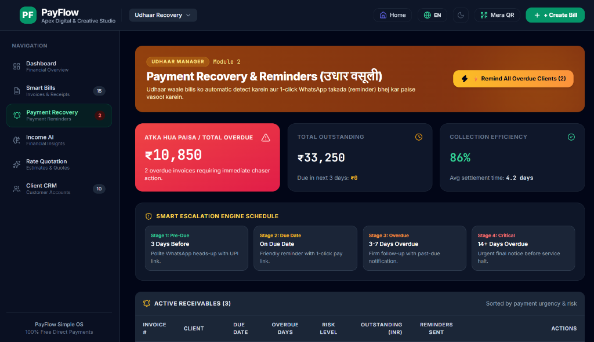

# ⚡ PayFlow — Simple Financial OS for Indian Freelancers & SMBs

[](https://reactjs.org/)
[](https://www.typescriptlang.org/)
[](https://vitejs.dev/)
[](https://tailwindcss.com/)
[](LICENSE)

**PayFlow** is a modern, 100% free financial operating system tailored for freelancers, agencies, and small businesses in India. PayFlow eliminates gateway commission fees by enabling direct UPI payment collection, automated **Udhaar (Payment Recovery)** chasers via WhatsApp, AI income intelligence, smart GST billing, and rate quotations.

---

## 📸 Product Preview



---

## 🔥 Key Modules & Features

### 1. 🔔 Payment Recovery & Reminders (`Udhaar Recovery`)
* **Smart 4-Stage Escalation Engine**:
  * **Stage 1 (Pre-Due)**: Gentle WhatsApp heads-up with UPI pay link 3 days before due date.
  * **Stage 2 (Due Date)**: Friendly reminder on due date.
  * **Stage 3 (Overdue 3–7 Days)**: Firm follow-up notice with past-due urgency.
  * **Stage 4 (Critical 14+ Days)**: Urgent final notice before service halt.
* **1-Click WhatsApp, Email & SMS Reminders**: Deep-links pre-populated reminder messages directly into WhatsApp with client phone numbers and UPI pay links.
* **Overdue Tracking**: Real-time stats on *Atka Hua Paisa* (Total Overdue), collection efficiency rates, and average settlement times.

### 2. 🧾 Smart GST Bills & Invoicing
* **GST & Tax Calculator**: Automatic 18% GST calculation, itemized line tables, and subtotal logic.
* **Vector PDF Export**: 1-click PDF download with branded headers, terms, and payment QR instructions using `jsPDF` & `html2canvas`.
* **Invoice Status Tracker**: Categorizes invoices into *Paid*, *Pending*, and *Overdue*.

### 3. 🧠 Income AI & Analytics
* **Cash Flow Insights**: Total revenue collected, outstanding receivables, and monthly trajectory.
* **AI Recommendations**: Actionable suggestions to improve collection speed and optimize billing schedules.

### 4. 📋 Rate Quotation Engine
* **Estimates & Proposals**: Create itemized scope quotes and send them to prospective clients.
* **1-Click Invoice Conversion**: Convert approved quotes directly into active invoices in a single click.

### 5. 👥 Client CRM & Ledger
* **Client Profiles**: Track individual customer billing history, total revenue generated, and active outstanding balances.
* **Contact Directory**: Store phone numbers, emails, GSTINs, and payment notes per client.

### 6. 🌐 Multilingual & Dark Mode Support
* **Vernacular Language Support**: Available in 10+ regional languages (Hindi, Marathi, Gujarati, Tamil, Telugu, Kannada, Bengali, Punjabi, Malayalam, English).
* **Sleek Dark Mode UI**: Full glassmorphism dark theme optimized for viewing financial metrics.

---

## 🛠️ Tech Stack

* **Frontend**: React 18 (TypeScript)
* **Build Tool**: Vite 6
* **Styling**: Tailwind CSS, Glassmorphism UI
* **Icons**: Lucide React
* **PDF Export**: jsPDF & html2canvas
* **Delight Effects**: Canvas Confetti

---

## 🚀 Getting Started

### Prerequisites
Make sure you have **Node.js** (v18 or higher) installed on your system.

### Installation

1. **Clone the Repository**
   ```bash
   git clone https://github.com/your-username/payflow.git
   cd payflow
   ```

2. **Install Dependencies**
   ```bash
   npm install
   ```

3. **Start Development Server**
   ```bash
   npm run dev
   ```
   Open `http://localhost:5173` in your browser.

4. **Build for Production**
   ```bash
   npm run build
   ```

---

## 📁 Project Structure

```
payflow/
├── public/
│   ├── dashboard_preview.png   # Main UI preview image
│   ├── favicon.svg
│   └── icons.svg
├── src/
│   ├── components/
│   │   ├── common/             # Navbar, Sidebar, Language Selector
│   │   ├── dashboard/          # Financial Overview & Stats Cards
│   │   ├── landing/            # Landing Page Presentation
│   │   └── onboarding/         # Setup Wizard
│   ├── context/
│   │   └── PayFlowContext.tsx  # Central State Management & Storage
│   ├── data/
│   │   └── seedData.ts         # Initial Demo Data
│   ├── modules/
│   │   ├── clients/            # Client CRM
│   │   ├── intelligence/       # Income AI & Financial Analytics
│   │   ├── invoicing/          # Invoice Engine & Builder Modal
│   │   ├── quotes/             # Rate Quotations Module
│   │   ├── reconciliation/     # UPI Payment Verification
│   │   └── recovery/           # Payment Recovery & Smart Reminder Modal
│   ├── types/
│   │   └── index.ts            # TypeScript Definitions
│   └── utils/
│       ├── formatters.ts       # Currency, Date & WhatsApp Link Generators
│       ├── pdfExport.ts        # PDF Canvas Engine
│       └── translations.ts     # Multilingual Translations Dictionary
├── README.md
├── package.json
└── vite.config.ts
```

---

## 📄 License

This project is open-source and available under the [MIT License](LICENSE).
